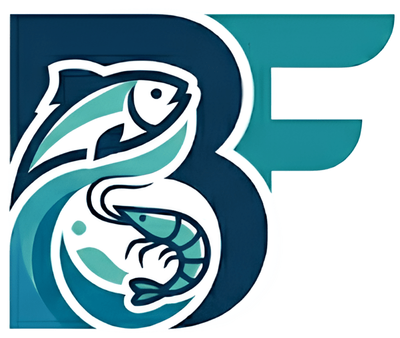
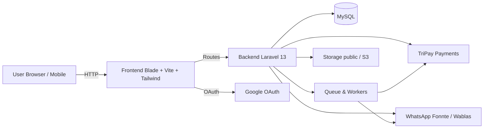

<div align="center">



# Borgfish 🐟

**Auction-first marketplace for fresh seafood**

[](https://laravel.com)
[](https://php.net)
[](https://filamentphp.com)
[](https://tailwindcss.com)
[](https://mysql.com)

[🌐 Live Demo](https://borgfish.my.id) · [📋 Features](#-features) · [⚙️ Setup](#️-quick-start) · [🏗️ Architecture](#️-architecture) · [📖 Manual Book](docs/manual-book.pdf)

</div>

---

## 📖 Overview

Borgfish is a full-stack web marketplace that connects **seafood sellers and buyers** through a transparent, automated auction system. Sellers list fish lots, buyers bid or buy directly, and the platform handles the entire lifecycle — from bid to payment verification to delivery pickup.

Built to solve real operational pain points for small-to-medium seafood sellers: inconsistent payment flows, manual reconciliation, and unreliable notifications.

**Key highlights:**
- Forward & reverse auction engine with anti-sniping support
- HMAC-verified payment callbacks via TriPay (QRIS, VA, e-wallet)
- WhatsApp OTP + Google OAuth authentication
- Queued notification outbox for reliable delivery
- Full 6-stage transaction lifecycle with real-time status tracking
- Filament admin panel for operational management

---

## 🚀 Features

### For Sellers
| Feature | Description |
|---|---|
| 📦 Lot Upload | Upload fish lots with photos, weight, catch date, packaging type |
| 📈 Auction Modes | Forward (price up) & Reverse (price down) auction |
| 💰 Buy Now | Fixed-price option to instantly end an auction |
| 📊 Dashboard | Summary of active, pending, ending-soon, and completed auctions |
| 📸 Packing Confirmation | Upload packing proof (photo, location, timestamp) |
| 🚚 Pickup Validation | Verify driver identity before releasing the lot |
| 🔔 WhatsApp Notifications | Auto-notified on every status change |

### For Buyers
| Feature | Description |
|---|---|
| 🛒 Live Marketplace | Browse all active lots with real-time bid counts & countdowns |
| 🏷️ Lot Detail | Full specs: starting price, increment, buy now price, catch date, bid history |
| 💸 Bidding | Place bids with minimum increment enforcement |
| ⚡ Buy Now | Skip the auction at a fixed price |
| 🏦 Multi-payment | QRIS, BRI/BCA/BNI/Mandiri VA, DANA via TriPay |
| 📋 Transaction Timeline | 6-stage tracking: Winner → Payment → Packing → Pickup → Done |
| ⭐ Rating | Rate sellers after receiving the lot |

---

## 🏗️ Architecture



**Tech Stack:**

- **Backend:** Laravel 13, PHP 8.3, Eloquent ORM, Queued Jobs, Scheduler
- **Frontend:** Blade Templates, Vite, Tailwind CSS, Alpine.js
- **Database:** MySQL (SQLite for local dev)
- **Auth:** Google OAuth (Socialite) + WhatsApp OTP
- **Payments:** TriPay — invoice creation, HMAC callback verification, reconciliation
- **Notifications:** Fonnte / Wablas WhatsApp API via queued outbox
- **Admin:** Filament — auction management, settlements, disputes
- **GPS:** Browser-based coordinate capture for seller store locations

---

## 🔄 Transaction Lifecycle

```
① Winner Determined
② Payment Confirmed     ← TriPay HMAC-verified callback
③ Seller Packs Lot      ← Upload photo proof + location
④ Pickup Data Sent      ← Buyer submits driver info
⑤ Pickup Validated      ← Seller verifies driver on-site
⑥ Transaction Complete  ← Buyer confirms receipt + rating
```

All stages emit WhatsApp notifications to both parties automatically.

---

## ⚙️ Quick Start

> PHP 8.3, Composer, and Node.js required.

```bash
# 1. Clone
git clone https://github.com/your-username/borgfish.git
cd borgfish

# 2. Install dependencies
composer install --prefer-dist --no-interaction
npm ci && npm run build

# 3. Environment
cp .env.example .env
php artisan key:generate

# 4. Database
php artisan migrate --seed

# 5. Start
php artisan serve
```

### Environment Variables

Edit `.env` — minimum required:

```env
APP_URL=http://localhost

# Google OAuth
GOOGLE_CLIENT_ID=
GOOGLE_CLIENT_SECRET=
GOOGLE_REDIRECT_URI=

# TriPay Payment Gateway
TRIPAY_API_KEY=
TRIPAY_PRIVATE_KEY=
TRIPAY_MERCHANT_CODE=

# WhatsApp API
FONNTE_TOKEN=

QUEUE_CONNECTION=database
FILESYSTEM_DISK=public
```

See `.env.example` for the full list.

### Queue Worker

```bash
php artisan queue:work --sleep=3 --tries=3
```

Production: use Supervisor to keep the worker alive.

```ini
[program:borgfish-queue]
command=php /path/to/borgfish/artisan queue:work --sleep=3 --tries=3
autostart=true
autorestart=true
user=www-data
stdout_logfile=/var/log/borgfish-queue.log
```

### Scheduler

```cron
* * * * * cd /path/to/borgfish && php artisan schedule:run >> /dev/null 2>&1
```

---

## 🔐 Security

- Google OAuth + WhatsApp OTP for identity verification
- Input validation at controller level (price, weight, date, photo rules)
- Access control: seller operations scoped to lot owner only
- Media uploads: max 3–4 MB, JPG/PNG/WebP only
- TriPay callbacks verified via HMAC SHA256
- Account deletion requires OTP re-verification

---

## 🧪 Useful Commands

```bash
php artisan test                    # Run tests
vendor/bin/phpstan analyse          # Static analysis
php artisan migrate                 # Run migrations
php artisan db:seed                 # Seed (local only)
```

---

## 🛣️ Roadmap

- [ ] GitHub Actions CI — tests, PHPStan, asset build
- [ ] End-to-end tests (Laravel Dusk / Playwright)
- [ ] Docker Compose for local development
- [ ] Structured logging + error tracking (Sentry)
- [ ] `SECURITY.md` and automated secret scanning
- [ ] Role-based ACL in Filament

---

## 📄 License

[MIT](LICENSE)

---

<div align="center">

Built by [Sabiq](https://github.com/maftoehillah) · Powered by Laravel 13

</div>
